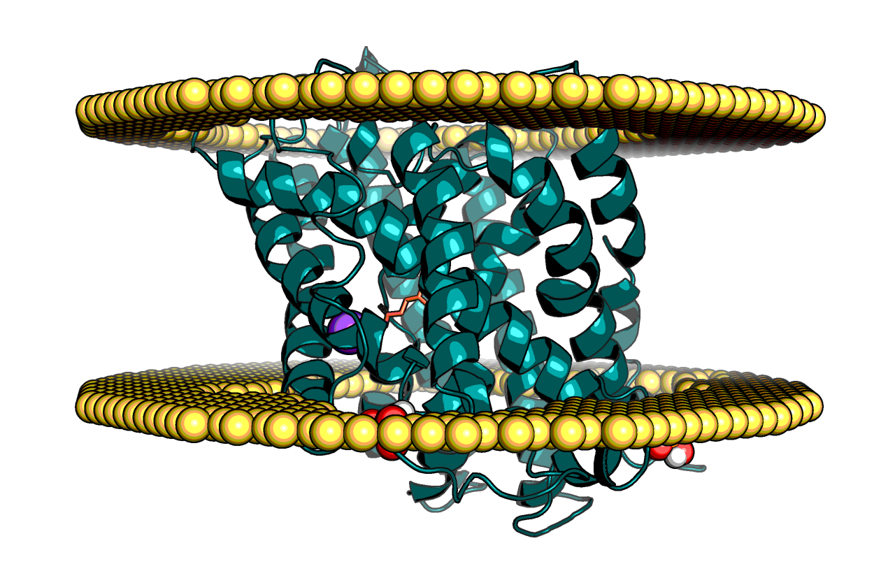
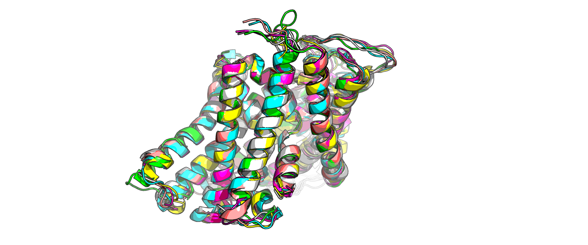
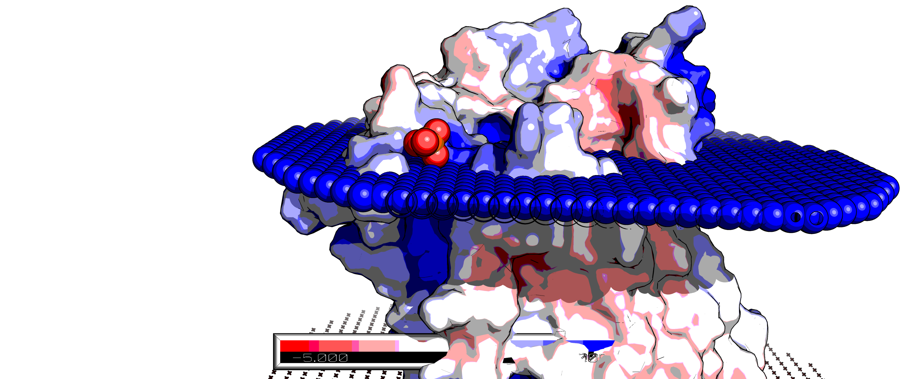

# SLC38A3 Analysis

> Please note, this repo does not contain mutant information

SLC38A3 is Sodium-coupled neutral amino acid transporter 3 ([Uniprot: S38A3_HUMAN](https://www.uniprot.org/uniprot/Q99624)).

There is no crystal structure available, but there is one for SLC38A9, PDB: 6C08
— described well in [Lei et al. 2018](https://www.nature.com/articles/s41594-018-0072-2).

## Reference

With the exception of the Extracellular part, Phyre and ITasser produced nearly identical structures.
There is no support, or need, for the extracellular fluff, so it was removed.

    pymol.cmd.remove('resi 1-68 or resi 245-282 or resi 494-504')

Swissmodel has no useful model, possibly due to this.
The Phyre model was chosen because it deviates less from the reference PDB: 6C08.

### ED and Membrane

Being a membrane protein the RosettaMP framework was used, but in a first step —to find odd bonds— an initial minimisation restrained against the 6C08 electron density was done.

I.e. the SLC38A3 model was aligned against the OPM model of 6C08, membrane-ified, and then moved to the 6C08 structure as located in 
the 2Fc-Fo map. This is slightly subpar to energy minimising the 6C08 structure as described below and threading against that, 
but it's unlikely to make a difference.

For detail of the process see [ED_and_mem](ED_and_mem.md).

## Ligands

On visual inspection the channel clearly appears to have phosphate-binding pockets on the cytoplasmic side.
This is common as there are plenty of phospholipids and PIP3 on the cytoplasmic leaf.
However, it would be imprudent guessing the exact moiety, even by docking score, so phosphates only were docked.

In PDB:6C08 there is a bound amino acid, arginine, this was added to the model, but as glutamine, by keeping the amino acid backbone contacts.

In the [Lei et al. 2018](https://www.nature.com/articles/s41594-018-0072-2) manuscript there is talk of a sodium being able to bind it this conformation
(cytoplasmically open). Therefore was added.

### Scorefunction

It should be noted that `ref2015` scorefunction was used for initial steps, but subsequently `franklin2019` was.

The `ref2015` can be used with the membrane framework 
(cf. [Alford et al. 2020](https://www.sciencedirect.com/science/article/pii/S000634952030237X)).
Although RosettaMP was released with `mpframework_smooth_fa_2012` scorefunction, the latest scorefunction `franklin2019` is newer/better.
There is also `ref2015_memb`, which was not used as this has nothing to do with the RosettaMP framework.