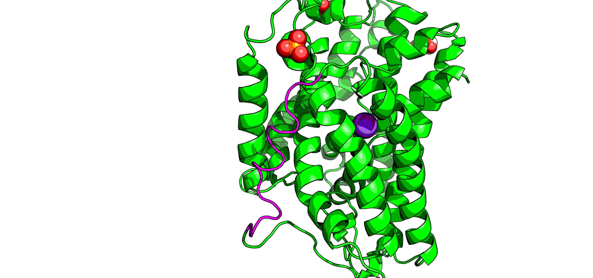

## Outstanding issues in model

3 low homology spans in the extracellular matrix:

* residues 1 (beginning) -68
* residues 245-282
* residues 494-502 (end)

2 malformed helices:

* residues 189-206
* residues 462-489

